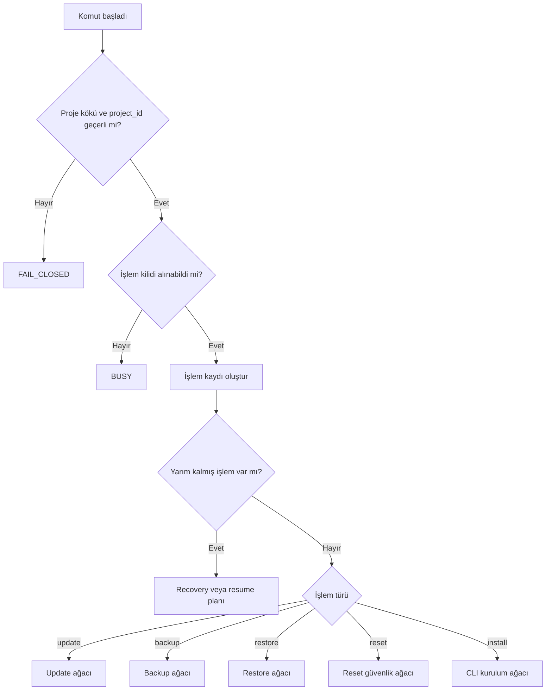
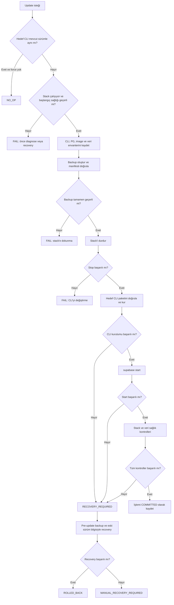
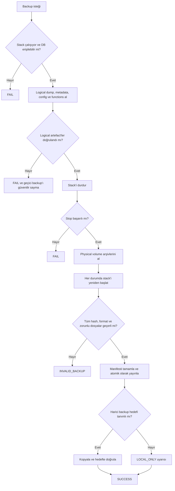
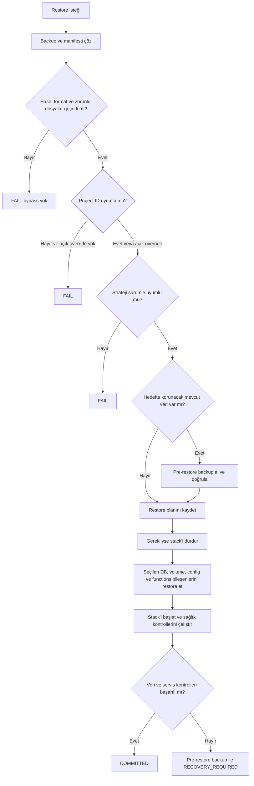

# Supabase CLI-managed self-host yaşam döngüsü

Bu dosya, repository içindeki kullanıcı komutlarının canonical karar ağacıdır.

Bu doküman, aynı Supabase CLI-managed Docker stack'inin yerel makinede veya
Hetzner gibi uzak bir sunucuda yönetilmesi için kanonik karar ağacıdır. Host
değişebilir; stack sürücüsü her durumda Supabase CLI'dır.

Bu ağaç normatiftir. Script davranışıyla bu doküman çelişirse script eksik
kabul edilir.

## Değişmez kurallar

1. Aynı anda yalnızca bir mutating işlem (`update`, `backup`, `restore`,
   `reset`) çalışabilir.
2. Her mutating işlem kalıcı bir işlem kimliği ve aşama kaydı tutar.
3. `CLI update`, CLI'nin yönettiği image setinin de güncellenmesi anlamına
   gelir.
4. Güncelleme çalışan ve doğrulanabilir bir stack üzerinde başlar.
5. Güncelleme öncesi backup zorunludur; onay veya `-y` bu kuralı atlayamaz.
6. Stack durdurulamadıysa veya kullanıcı durdurmayı reddettiyse CLI kurulumu
   başlamaz.
7. Backup bütünlüğü bozuksa restore başlamaz. İnteraktif onay da bütünlük
   hatasını atlayamaz.
8. Başarı yalnızca CLI kurulması veya container başlaması değildir. Stack,
   database ve korunması gereken veri doğrulanmalıdır.
9. Başarısız stateful işlem `SUCCESS` olarak raporlanmaz; işlem
   `RECOVERY_REQUIRED` durumuna geçer.
10. `reset`, normal update yolu değildir. Yalnızca doğrulanmış backup ve açık
    restore/recovery planıyla kullanılabilir.

## Üst seviye karar ağacı



## Update karar ağacı



Update sağlık kontrolü en az şunları kapsar:

- `supabase status`
- Gerekli container'ların çalışır/healthy olması
- PostgreSQL `SELECT 1`
- PostgreSQL sürümü ve temel tablo/kullanıcı/bucket sayılarının beklenen
  değerlerle karşılaştırılması
- Auth, REST ve Storage için kısa sentetik kontroller

`--reset` ile update istenirse update ağacına doğrudan girilmez:

```text
backup geçerli değil       -> FAIL
restore hedefi belirtilmemiş -> FAIL
stop --no-backup başarısız -> FAIL
temiz start başarısız      -> RECOVERY_REQUIRED
restore başarısız          -> RECOVERY_REQUIRED
restore sonrası sağlık yok -> RECOVERY_REQUIRED
```

## Backup karar ağacı



## Restore karar ağacı



Uyumluluk kuralları:

- Volume restore, backup'ın CLI/image/PG ailesiyle hedefin uyumluluğu
  kanıtlanmadan çalışmaz.
- SQL restore farklı sürümler için daha toleranslıdır; yine de dump formatı,
  extension'lar ve hedef PostgreSQL sürümü preflight sırasında kontrol edilir.
- Config restore varsayılan olarak kapalı kalabilir, ancak seçildiğinde secret
  dosya izinleri korunmalıdır.

## Reset güvenlik ağacı

```text
project marker yok                    -> FAIL
canonical hedef / veya HOME           -> FAIL
doğrulanmış backup yok                -> FAIL
açık destructive onay yok             -> CANCEL
Supabase stop başarısız                -> FAIL, dosya/volume silme
global Docker prune istendi            -> ayrı açık onay ve etki raporu
reset sonrası restore planı yok        -> FAIL
```

## Mevcut kod uygunluk denetimi

Durumlar:

- **UYUYOR:** Dal mevcut ve fail/success sonucu ağaca uygun.
- **KISMEN:** Temel davranış var fakat bir güvenlik veya doğrulama dalı eksik.
- **UYMUYOR:** Dal yok ya da ağaçtaki fail-closed kuralının tersine devam ediyor.

| ID | Karar ağacı şartı | Durum | Mevcut davranış |
|---|---|---|---|
| G1 | Canonical proje ve `project_id` tespiti | UYUYOR | Update, backup, restore ve reset marker ile gerçek `project_id` olmadan başlamıyor. |
| G2 | Tek mutating işlem kilidi | UYUYOR | Update host-global CLI kilidi ile proje kilidini birlikte; backup, restore ve reset proje kilidini kullanıyor. |
| G3 | Kalıcı işlem/aşama kaydı | UYUYOR | Ortak journal aşama ve sonuç tutuyor; yarım update `--recover` ile devam ettirilebiliyor. |
| U1 | Hedef CLI ve paket bütünlüğü | UYUYOR | Release tag doğrulanıyor; GitHub asset SHA-256 ve kurulan sürüm kontrol ediliyor. |
| U2 | Update başlangıcında çalışan ve sağlıklı stack | UYUYOR | Update çalışan stack gerektiriyor; zorunlu backup DB erişimini de doğruluyor. |
| U3 | Update öncesi doğrulanmış backup zorunluluğu | UYUYOR | `--no-backup` reddediliyor; backup komutu ve ayrı verify başarılı olmadan stop başlamıyor. |
| U4 | Stop başarısızsa veya reddedilirse kurulumu durdur | UYUYOR | Stop reddi veya komut hatası CLI kurulumundan önce non-zero çıkıyor. |
| U5 | CLI, PG, image ve veri envanteri | UYUYOR | Journal CLI hedeflerini ve çalışan image envanterini; backup manifesti PG ve veri sayılarını kaydediyor. |
| U6 | CLI kurulumunu doğrula | UYUYOR | Paket ve aktif binary sürümü doğrulanıyor. |
| U7 | Update sonrası stack'i başlat | UYUYOR | `--no-start` reddediliyor; start reddi veya hatası update'i başarısız yapıyor. |
| U8 | Tam servis ve veri health gate'i | UYUYOR | Container durumu, DB erişimi, manifest veri sayıları ve gateway üzerinden Auth/REST/Storage sentetik istekleri zorunlu. |
| U9 | Update/start/health hatasında recovery | UYUYOR | Eski CLI + doğrulanmış physical backup ile otomatik recovery deneniyor; yarım journal `--recover` destekliyor. |
| U10 | `--reset` yalnızca zorunlu restore planıyla | UYUYOR | `--reset`, zorunlu backup yanında `--restore-after` olmadan başlamıyor. |
| B1 | Stack ve DB preflight | UYUYOR | Backup çalışan stack gerektiriyor ve DB container'ına erişiyor. |
| B2 | DB, volume, config, functions ve metadata kapsamı | UYUYOR | Logical/full dump, volume, `.env`, config, functions ve metadata alınıyor. |
| B3 | Tutarlı physical snapshot ve restart garantisi | UYUYOR | Stack durdurularak arşiv alınıyor; normal ve EXIT yollarında restart deneniyor. |
| B4 | Manifest, hash, format ve zorunlu dump doğrulaması | UYUYOR | Backup yayınlanmadan otomatik doğrulama yapılıyor. |
| B5 | Harici failure-domain kopyası | UYUYOR | Mirror tanımlandığında 0600 anahtar dosyası zorunlu; backup AES-256 GPG arşivi olarak yazılıyor, decrypt/tar ve yayınlama sonrası SHA-256 doğrulaması yapılıyor. Tanımsızsa açık `LOCAL_ONLY` uyarısı veriliyor. |
| B6 | Backup'ı staging dizininden atomik yayınlama | UYUYOR | Backup gizli staging dizininde hazırlanıp doğrulamadan sonra tek `mv` ile yayınlanıyor. |
| R1 | Bozuk backup hiçbir şekilde kullanılamaz | UYUYOR | Hash hatası interaktif ve non-interaktif tüm modlarda restore'u durduruyor. |
| R2 | Project mismatch açık override ister | UYUYOR | `--allow-project-mismatch` olmadan duruyor. |
| R3 | CLI/PG/strateji uyumluluk gate'i | UYUYOR | Volume/hybrid aynı CLI ve PG ailesini; SQL restore desteklenen yönü ve hedefte gerekli extension'ların bulunmasını zorunlu tutuyor. |
| R4 | Mevcut hedef için doğrulanmış pre-backup | UYUYOR | Mevcut stack/DB volume algılanırsa doğrulanmış pre-backup zorunlu; yalnız update recovery iç modu bunu atlayabiliyor. |
| R5 | Güvenli volume ve SQL restore | UYUYOR | Volume label, ownership, ACL ve xattr metadata'sı korunuyor; SQL geçici DB'ye yüklenip atomik DB isim değişimi yapılıyor. |
| R6 | Restore sonrası tam health gate'i | UYUYOR | DB ve manifest veri sayıları yanında gateway üzerinden Auth, REST ve Storage sentetik istekleri doğrulanıyor. |
| R7 | Restore hatasında otomatik recovery | UYUYOR | Mutasyon sonrası hata varsa bu işlemde doğrulanan pre-restore physical backup otomatik olarak geri yükleniyor; başarısızlık journal'da `recovery_required` kalıyor. |
| X1 | Reset öncesi doğrulanmış backup | UYUYOR | Reset başlamadan backup alınması ve ayrıca doğrulanması zorunlu. |
| X2 | Canonical destructive path ve stop-failure koruması | UYUYOR | `/`, HOME ve marker olmayan hedef engelleniyor; stop hatasında klasör silinmiyor. |
| X3 | Global Docker cleanup kapsam güvenliği | UYUYOR | Global Docker prune devre dışı; Supabase dışı kaynakların kapsam dışında olduğu bildiriliyor. |

## Sonuç

Denetim tablosundaki tüm zorunlu dallar uygulanmıştır. Gerçek disposable
drill'lerde SQL restore, DB+Storage physical restore, Storage byte round-trip,
şifreli mirror, CLI 2.107.0→2.108.0 update ve injected start-failure recovery
geçmiştir. Host tarafında mirror hedefinin ve 0600 anahtar dosyasının
yapılandırılması deployment politikasıdır.

2026-06-28 ek operasyon doğrulamaları:

- Backup ve package staging disk preflight: UYUYOR
- Encrypted mirror import + normal manifest doğrulaması: UYUYOR
- Local/mirror birleşik retention ve minimum yeni backup koruması: UYUYOR
- SIGKILL sonrası kalıcı journal ile açık `--recover`: UYUYOR
- systemd timer ve failure notification hook sözleşmesi: UYUYOR
